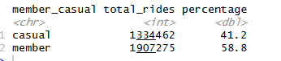

# Google Case Study: 

perform data analysis for a fictional bike-share company in order to help them attract more riders

# Business Objective:
    - Converting casual riders into annual members 

# Business Problem
 1) How do annual members and casual riders use Cycleistic bike differently?
 2) Why would causal riders buy Cyclistic annual memeberships?
 3) How can Cyclistic use digital media to infleunce casual riders to become members?

# Data sources:
    - From 
    - 12 csv files of approx. 2-3 millions rows of data, 12 columns of data

# Preparing data
SQL

Joining all 12 datasets using UNION ALL syntax since all of the datasets contains the same amount of columns amd names.

Merged dataset contains 3,489,431 records of observations.

Cleaning data
    - Removing some columns as it would be unnesscary for my analysis 
        - 4 columns removed
    - Checking for duplicates, no duplicates found
    - Extract date and time from datetime columns for better readability
        - 4 new columns added
    - Create ride_length columns
    - Create week_day column
    - Checking for NULL cells, none founded but instead empty strings founded
        - Convert all empty string into NULLs 
            -count 122,175 empty for start_station_name
            -count 143,242 empty for end_station_name
        - Removed all the NULL cells
    - Checking for bad data
        - Notice that MAX ride_length is 58,720, this is outliers to consider
            - 58720 is basically multiple days
        - Filtered ride_length column to remove ride_length that is more than 1440 to have only data within the 24hrs 
        
 Final clean data contains 3,241,737 rows and 12 columns
    - 247,694 rows of data removed
    

# Analysis
 I want to know the populations of riders
   
*Figure 1: Membership breakdown showing 59% members and 41% casual riders.*

    - I want to know riders monthly activity level 
    - I want to know what times are riders most active
    - I want to know riders average ride length 
    - What days are riders most active
    - Which bikes are riders using the most

# Summary

    From April 2020 to February 2021, a total of 3,241,737 rides were taken using   
Cyclistic services. Members accounted for 59% of all rides, while casual riders made up 41%. Although members show higher overall engagement, casual riders take significantly longer trips, averaging 37 minutes compared to 16 minutes for members.

    Analysis of rider participation throughout the year reveals a clear seasonal 
fluctuation in ridership. Activity increases substantially during the warmer months, peaking at 18.4% of total rides in August. In contrast, colder months such as January and February account for only 1–3% of total rides, indicating that rider participation drops sharply during winter conditions.

    The daily riding patterns between casual and member riders are also very similar. 
Both groups are most active between 2 PM and 6 PM, with the highest participation on weekends, particularly Saturdays. Additionally, the docked bike is the most popular choice among both riders, accounting for the majority of total rides across all bike categories.

    However, there is a distinct difference in trip behavior. While both rider groups 
often start from similar locations, members tend to end their trips at different destinations, suggesting point-to-point commuting. In contrast, casual riders are more likely to return to their starting locations, indicating recreational or leisure-based usage.

    Although demographic data is unavailable to draw firm conclusions, the findings 
suggest that casual riders primarily use Cyclistic services for leisure, whereas members exhibit commuting patterns and consistent year-round usage.

# Recommendations

1. How do annual members and casual riders use Cyclistic bikes differently?  

The main difference between how causal and member use the ride differently is the purpose of it. 

Looking at only the data of casual rider, they account for 41% of the total activity but ride the bike approx 50% longer than member rider. 

Casual rides the bike longer than members by more than double especially during the weekends, this can be explain that they use it for leisure purpose at the location where it is near the park, bike-friendly neighbors, and etc 

2. Why would casual riders buy Cyclistic annual memberships?  

Varieties of bike available for all ages and most importantly, provides bikes for assistance needs 

Options for consumer to transition from car to bike  

More flexibility for transportations 

Supporting the movement behind Greener environment 

3. How can Cyclistic use digital media to infleunce casual riders to become members? 

Casual rider are more likely to return at the same location where they pick up the bikes. We can have poster or signage with QR codes that link straight to the website for registering to become members 
    -Highlight the availability of different types bikes to give casual rider more reasons to get annual membership 

During slow seasons, we can provide membership promotions with discount to attract casual rider to become member 

Create a referral system, data suggested that where member are, causal rider are highly likey to be there as well. 

# Feedbacks to myself
I learn serveral things from this project:
    - The importance of metadata
        - I wasn't sure what classic bike and docked bike refers to exactly 
    - The importance of having 
        - The lack of demographic data of the user

