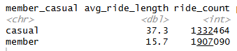
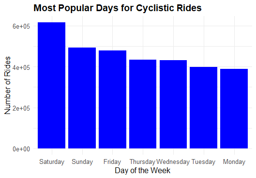
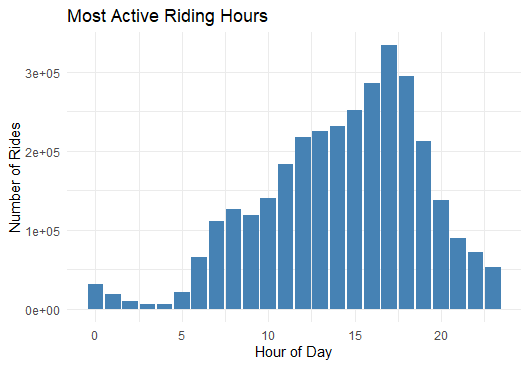
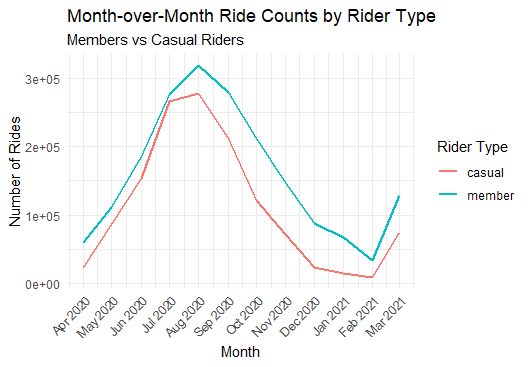

# Google Case Study: 

Perform data analysis for a fictional bike-share company in order to help them attract more riders

# Business Objective:  
Converting casual riders into annual members 

# Business Problem
 1) How do annual members and casual riders use Cycleistic bike differently?
 2) Why would causal riders buy Cyclistic annual memeberships?
 3) How can Cyclistic use digital media to infleunce casual riders to become members?

# Data sources:
From 
12 csv files of approx. 2-3 millions rows of data, 12 columns of data

# Preparing data
Tools: SQL

Joining all 12 datasets using UNION ALL syntax since all of the datasets contains the same amount of columns amd names.

Merged dataset contains 3,489,431 records of observations.

### Cleaning data

- **Removing some columns** as it would be unnecessary for my analysis  
  - 4 columns removed  
- **Checking for duplicates** — no duplicates found  
- **Extracted date and time** from datetime columns for better readability  
  - 4 new columns added  
- **Created `ride_length` column**  
- **Created `week_day` column**  
- **Checked for NULL cells** — none found, but empty strings were detected  
  - Converted all empty strings into NULLs  
  - Counted 122,175 empty for `start_station_name`  
  - Counted 143,242 empty for `end_station_name`  
  - Removed all NULL cells  
- **Checked for bad data**  
  - Noticed MAX ride_length is 58,720 (outlier — represents multiple days)  
  - Filtered ride_length column to remove values > 1440 (limit to 24 hours)

**Final clean data:**  
- 3,241,737 rows and 12 columns  
- 247,694 rows removed

    

# Analysis

Tools: R

*Figure 1: Membership breakdown showing 59% members and 41% casual riders.*  
  

*Figure 2: Average ride length between casual and member*  
   

*Figure 3: Riders Weekdays Engagment*  
  

*Figure 4: Distribution of Riding Hours*  
  
*Figure 4: Distribution of Riding Hours*  

*Figure 5: Monthly Ride Trends by Rider Type*  
  

# Summary

From April 2020 to February 2021, a total of **3,241,737 rides** were taken using **Cyclictic** services.  
Members accounted for **59%** of all rides, while casual riders made up **41%**.  
Although members show higher overall engagement, casual riders take significantly longer trips, averaging **37 minutes** compared to **16 minutes** for members.  

Analysis of rider participation throughout the year reveals a clear **seasonal fluctuation** in ridership.  
Activity increases substantially during the warmer months, peaking at **18.4%** of total rides in **August**.  
In contrast, colder months such as **January** and **February** account for only **1–3%** of total rides, indicating that participation drops sharply during winter conditions.  

The daily riding patterns between **casual** and **member riders** are also very similar.  
Both groups are most active between **2 PM and 6 PM**, with the highest participation on **weekends**, particularly **Saturdays**.  
Additionally, the **docked bike** is the most popular choice among both riders, accounting for the majority of total rides across all bike categories.  

However, there is a distinct difference in **trip behavior**.  
While both groups often start from similar locations, members tend to end their trips at different destinations — suggesting **point-to-point commuting**.  
In contrast, casual riders are more likely to return to their starting locations, indicating **recreational or leisure-based usage**.  

Although demographic data is unavailable to draw firm conclusions, the findings suggest that **casual riders primarily use Cyclictic services for leisure**, whereas **members exhibit commuting patterns** and consistent **year-round usage**.

# Recommendations

### 1. How do annual members and casual riders use Cyclistic bikes differently?

The main difference between how casual and member riders use the service lies in **purpose**.

Looking at the data, **casual riders** account for **41%** of total activity but take rides approximately **50% longer** than members.  
Casual riders typically use the bikes for **leisure**, especially during weekends, often in areas near **parks** or **bike-friendly neighborhoods**.

In contrast, **members** show more consistent, **commute-based usage**, likely for daily travel to work or school.

---

### 2. Why would casual riders buy Cyclistic annual memberships?

- Variety of bikes available for all ages and needs (including assistance bikes)  
- Encourages **transition from cars to bikes**, promoting eco-friendly transport  
- Provides **greater flexibility** in transportation  
- Supports the movement toward a **greener environment**  

---

### 3. How can Cyclistic use digital media to influence casual riders to become members?

Casual riders are more likely to return to the same starting location.  
Cyclistic can take advantage of this behavior by using **digital and physical marketing**:

- Highlight the **availability of different bike types** to attract riders to annual memberships  
- Use **QR codes** on signage or bikes that link directly to membership registration  
- Provide **membership promotions or discounts** during slow seasons to encourage sign-ups  
- Create a **referral system**, since data shows that where members ride, casual riders are also highly likely to be nearby  

---

# Feedback to Myself

I learned several things from this project:

- **The importance of metadata**  
  - I wasn't sure what *classic bike* and *docked bike* referred to exactly.

- **The importance of having more contextual data**  
  - The lack of demographic information limited the depth of the analysis.

